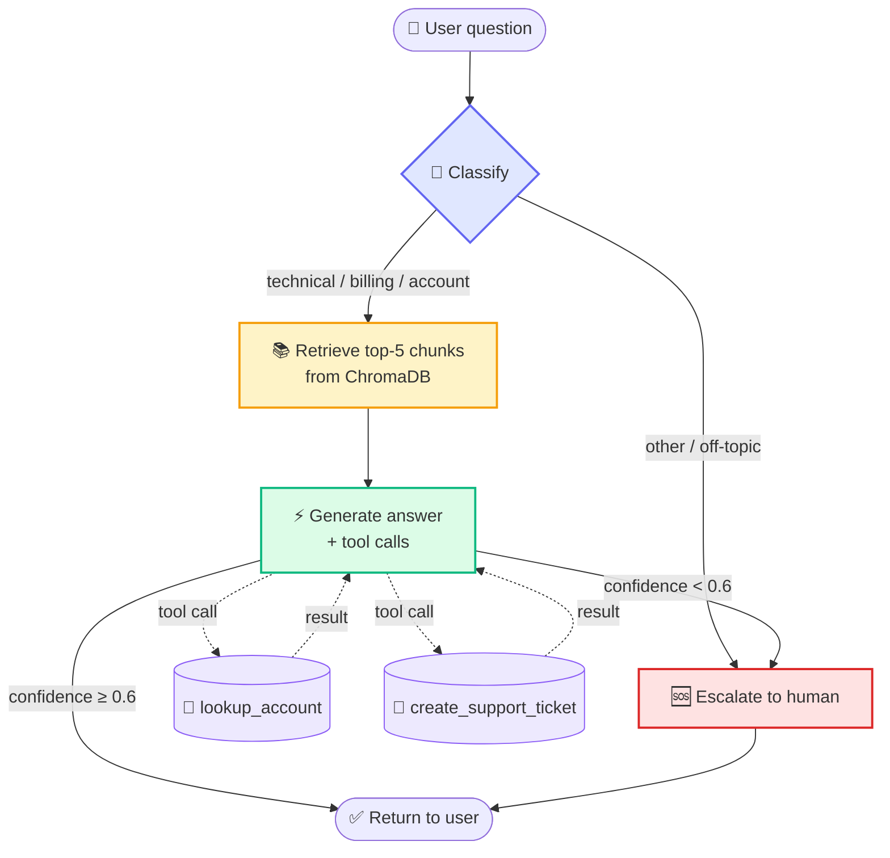

<div align="center">

# 🤖 Support Copilot

**Open-source AI customer support agent. Drop in your docs, ship a 24/7 support copilot in an afternoon.**

*"Decagon / Intercom Fin for everyone else."*


[Architecture](#-architecture) · [Quickstart](#-quickstart) · [Demo queries](#-try-it) · [Roadmap](#-roadmap)

</div>

---

## 🎯 The problem

Companies pay **$50K to $200K per year** for AI support tools (Decagon, Sierra, Intercom Fin, Forethought). That price tag locks out 99 percent of SMBs and indie developers. Every one of them has the same pain — too many support questions, not enough humans.

## 💡 The solution

Support Copilot is the **self-hostable open-source version**. Point it at any folder of docs and you get a production-shaped AI agent:

| Feature | Status |
|---|---|
| 🧠 Multi-step LangGraph state machine | ✅ Shipped |
| 📚 RAG-grounded answers via ChromaDB | ✅ Shipped |
| 💬 Conversation memory across turns | ✅ Shipped |
| 🔧 Native tool calling (MCP-ready) | ✅ Shipped |
| 🆘 Confidence-based human escalation | ✅ Shipped |
| ⚡ Off-topic short-circuit (saves an LLM call) | ✅ Shipped |
| 🎨 Polished Streamlit UI with live metrics | ✅ Shipped |
| 🐳 Dockerfile for portable deployment | ✅ Shipped |
| 🔌 Remote MCP server | 🛠 Scaffolded |
| 📄 PDF + Markdown ingestion | 📋 Roadmap |
| 📈 RAGAS eval harness | 📋 Roadmap |

## 🏗️ Architecture



## 🛠️ Stack

| Layer | Technology | Why |
|---|---|---|
| Agent orchestration | **LangGraph** | StateGraph with conditional edges, perfect for branching support flows |
| LLM | **Anthropic Claude (Sonnet 4.6)** | Best-in-class tool use and grounded reasoning |
| Vector retrieval | **ChromaDB** | In-memory, zero-config, auto-rebuilt on startup |
| Tool calling | **Anthropic native tool-use API** | Same primitive that MCP wraps remotely |
| Tool exposure | **MCP-ready** | `mcp_server.py` scaffolds the remote-server path |
| Chat UI | **Streamlit** | Fast iteration, native chat components |
| Container | **Docker** | Portable to AWS, GCP, any Docker host |

## ⚡ Quickstart

```bash
git clone https://github.com/BQ77/support-copilot
cd support-copilot
python -m venv .venv && source .venv/bin/activate
pip install -r requirements.txt
echo "ANTHROPIC_API_KEY=sk-ant-..." > .env
streamlit run app.py
```

Or with Docker:

```bash
docker build -t support-copilot .
docker run -p 8501:8501 --env-file .env support-copilot
```

Then open http://localhost:8501 and start chatting. Drop your own `.txt` docs into `docs/` to ground the agent on your domain.

## 🎮 Try it

Live demo: **deploying to Streamlit Cloud** (URL coming)

Sample queries the demo handles end to end:

| Query | What happens |
|---|---|
| *"How do I create an API key?"* | RAG → grounded answer with source citations |
| *"What does a 429 error mean?"* | RAG → cites errors.txt and rate_limits.txt |
| *"What's my usage? My email is jane@acme.com"* | Calls `lookup_account` tool, weaves account data into answer |
| *"Please file a high-priority ticket: I was double-charged $199"* | Calls `create_support_ticket` tool, returns ticket ID |
| *"What's the weather in Paris?"* | Off-topic → instant escalation, skips retrieval |

## 📊 What you see in the UI

- **Status pill** — high / medium / low confidence indicator
- **Metric cards** — category, latency, number of tools used
- **Tool call inspector** — every tool input and JSON result
- **Source citations** — which doc chunks grounded each answer
- **Escalation banner** — fired when the agent defers to a human

## 🗺️ Roadmap

- [x] LangGraph multi-step agent
- [x] RAG with ChromaDB
- [x] Conversation memory
- [x] Native tool calling (MCP-ready)
- [x] Confidence-based escalation
- [x] Off-topic short-circuit
- [x] Polished Streamlit UI
- [x] Dockerfile
- [ ] Wrap tools as remote MCP server (scaffolded in `mcp_server.py`)
- [ ] PDF + Markdown ingestion (currently .txt only)
- [ ] Operator dashboard — escalation rate, latency P95, tool-use frequency over time
- [ ] Multi-tenant deployment (one agent per organization's docs)
- [ ] RAGAS eval harness for retrieval and answer quality
- [ ] Streaming responses

## 🤝 Contributing

PRs welcome. Please open an issue before working on anything large.

## 📄 License

MIT — do whatever you want with it.

---

<div align="center">

**Built for SMBs and indie devs who can't afford a $50K/year support stack.**

</div>
